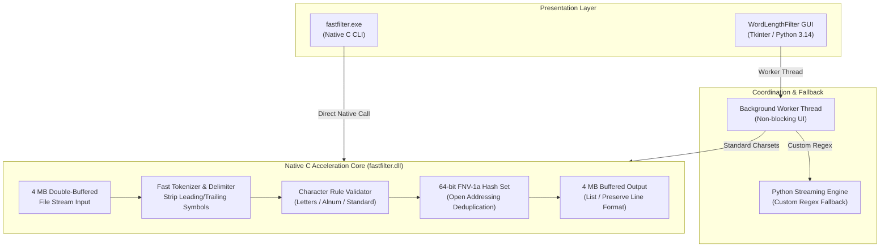

# WordLengthFilter ⚡

[](CHANGELOG.md)
[-0078D6.svg?logo=windows)](#)
[](#)
[-00599C.svg?logo=c)](#)
[](LICENSE)

**WordLengthFilter** is a high-performance dictionary and wordlist filtering utility for Windows. Engineered for security engineers, penetration testers, and data researchers, it processes multi-gigabyte wordlists (such as RockYou or custom password dictionaries) in seconds with a minimal memory footprint.

It ships as both a **standalone desktop GUI** (`WordLengthFilter.exe`) and an **ultra-fast native C CLI** (`fastfilter.exe`).

---

## Architecture Overview



---

## Key Features

- **⚡ Blazing Fast Native C Engine**: Uses 4 MB buffered disk I/O to stream files continuously without loading entire wordlists into memory.
- **💾 Low Memory Footprint**: Filters 50M+ line wordlists using only ~8–64 MB of RAM (compared to 8–16 GB in pure Python).
- **🖥️ Non-Blocking Windows GUI**: Operations run on background worker threads—the UI remains smooth and responsive without freezing.
- **🔍 64-bit FNV-1a Deduplication**: Dynamic open-addressing hash set eliminates duplicates at line rate.
- **🎯 Flexible Character Set Rules**:
  - **All characters**: Standard wordlist tokens with hyphens and apostrophes (trims exterior delimiters).
  - **Letters only**: Pure alphabetic words (excludes numbers, punctuation, and symbols).
  - **Alphanumeric only**: Letters and numbers, omitting punctuation.
  - **Custom Regex**: User-defined regular expressions (via streaming Python engine).
- **📂 Output Formats**: Choose between standard wordlist format (one word per line) or preserving line structures.
- **📦 Zero-Dependency Standalone Binaries**: Single-file executables that run out-of-the-box on Windows 10/11 without requiring Python or runtime installations.

---

## Binaries

| Binary | Type | Description |
| :--- | :--- | :--- |
| **`dist/WordLengthFilter.exe`** | Standalone GUI | Full desktop UI bundled with Tkinter and the embedded C acceleration engine. |
| **`dist/fastfilter.exe`** | Standalone CLI | Lightweight (~95 KB) zero-dependency native C command-line tool. |

---

## CLI Usage (`fastfilter.exe`)

```
fastfilter.exe <source_file> <output_file> [min_len] [max_len] [charset_mode] [output_mode] [dedup]
```

### Parameters

| Argument | Type | Default | Options |
| :--- | :--- | :--- | :--- |
| `<source_file>` | Required | — | Path to source text or wordlist file |
| `<output_file>` | Required | — | Path where the filtered file will be saved |
| `[min_len]` | Optional | `3` | Minimum word character length |
| `[max_len]` | Optional | `12` | Maximum word character length |
| `[charset_mode]`| Optional | `0` | `0` = All words, `1` = Letters only, `2` = Alphanumeric only |
| `[output_mode]` | Optional | `0` | `0` = One word per line, `1` = Preserve line structure |
| `[dedup]` | Optional | `0` | `0` = Keep duplicates, `1` = Unique words only |

### Practical Examples

```powershell
# 1. Filter a dictionary for WPA2-PSK rules (8-12 characters, unique words)
.\dist\fastfilter.exe rockyou.txt wpa2_candidates.txt 8 12 0 0 1

# 2. Extract strictly alphabetic words between 4 and 10 characters
.\dist\fastfilter.exe raw_corpus.txt clean_words.txt 4 10 1 0 1

# 3. Filter alphanumeric passwords (exclude punctuation) of length 6 to 16
.\dist\fastfilter.exe passwords.txt alnum_passwords.txt 6 16 2 0 0
```

---

## Building from Source

### Prerequisites
- Python 3.10+ (with `tkinter` included in standard Windows installer)
- GCC Compiler (included in the bundled `w64devkit/` or any MinGW in PATH)
- PyInstaller: `pip install pyinstaller`

### Single-Click Build
Run the automated build script:
```powershell
.\build.bat
```
This automatically compiles:
1. `fastfilter.dll` (optimized `-O3` shared library)
2. `dist\fastfilter.exe` (standalone CLI binary)
3. `dist\WordLengthFilter.exe` (PyInstaller single-file bundle)

---

## Automated Versioning & Releases

This repository includes automated Semantic Versioning (SemVer) tooling:

### Bumping the Version
Use the PowerShell wrapper or Python script:
```powershell
# Bump patch version (1.0.0 -> 1.0.1) and create a git commit + tag
.\scripts\bump_version.ps1 patch -Commit

# Bump minor version (1.0.0 -> 1.1.0) and push to remote
.\scripts\bump_version.ps1 minor -Commit -Push

# Specify an exact version
.\scripts\bump_version.ps1 -Bump "1.2.0" -Commit -Push
```

### What the Versioning Script Automates
- Updates [`version.json`](version.json) (version, major, minor, patch, build number, release date).
- Updates [`VERSION`](VERSION).
- Updates `__version__` in [`filter_app.py`](filter_app.py).
- Updates `FASTFILTER_VERSION` in [`fastfilter.c`](fastfilter.c).
- Adds the release header to [`CHANGELOG.md`](CHANGELOG.md).
- Creates an annotated Git tag (`vX.Y.Z`).
- Triggers GitHub Actions to automatically compile standalone binaries and attach them to a GitHub Release.

---

## License

This project is licensed under the [MIT License](LICENSE).
